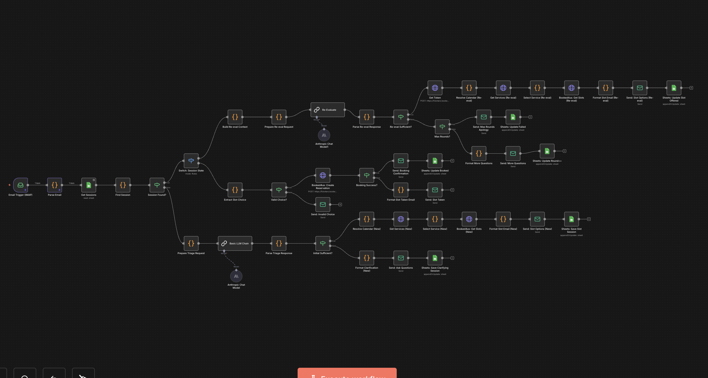

# Fiziotars Booking Automation

AI-powered patient booking assistant for the Fiziotars physiotherapy clinic. Patients email a request in natural language — the system understands it, checks availability via the booked4.us API, and books the appointment through a conversational email exchange. No human intervention required.

---

## What it does

A patient sends an email like:

> *"Szeretnék időpontot kérni hétfőn délután, lehetőleg 2 és 4 óra között."*
> *(I'd like an appointment on Monday afternoon, preferably between 2 and 4.)*

The system:
1. Reads the email via IMAP
2. Sends it to Claude AI to triage — does it have enough information to book, or does it need clarification?
3. If more info is needed, asks the patient (up to 3 clarification rounds)
4. Once sufficient, queries booked4.us for available slots and offers them by email
5. Patient replies with their choice (e.g. *"1"* or *"the second one"*)
6. Claude extracts the selection, books it via the booked4.us API
7. Confirmation email sent — conversation closed

All patient-facing messages are in Hungarian.

---

## Architecture

```
Email (IMAP)
    │
    ▼
Parse email — filter own replies, extract In-Reply-To / REF# headers
    │
    ▼
Google Sheets — load all sessions, find match by session_id
    │
    ├── Existing session → Switch on state
    │       ├── clarifying   → Claude re-evaluation → ask again or offer slots
    │       └── slot_offered → Claude extracts choice → book via booked4us API
    │
    └── New session → Claude triage
            ├── sufficient info → fetch free slots → offer by email
            └── missing info    → ask clarification (max 3 rounds, then apology)
    │
    ▼
Send reply (same email thread) → update session in Google Sheets
```

**Session states:** `clarifying` → `slot_offered` → `booked` / `failed`



---

## Stack

| Layer | Technology |
|---|---|
| Automation | [n8n](https://n8n.io) (self-hosted at n8n.laszlot.hu) — 43 nodes |
| AI | Anthropic Claude (`claude-opus-4-6`) via HTTP API |
| Booking | [booked4.us](https://booked4.us) REST API v2 |
| Session state | Google Sheets (`Sessions` sheet) |
| Email | Custom IMAP (receive) + SMTP (send) |

---

## Session tracking

Dual-method to reliably match replies to their conversation:

1. **Primary:** `In-Reply-To` email header — standard email threading
2. **Fallback:** `REF#XXXXXXXX` reference code embedded in the subject line — catches cases where email clients strip headers

Sessions are stored in Google Sheets with the following schema:

| Column | Description |
|---|---|
| `session_id` | Unique identifier |
| `patient_email` | Patient's email address |
| `patient_name` | Patient's name |
| `state` | `clarifying` / `slot_offered` / `booked` / `failed` |
| `clarification_round` | Current round (max 3) |
| `gathered_info` | JSON — info collected so far |
| `offered_slots` | JSON — slots presented to patient |
| `last_sent_message_id` | For In-Reply-To threading |
| `thread_subject` | For REF# fallback matching |
| `created_at` / `updated_at` | Timestamps |

---

## Setup

### Credentials to configure in n8n

| Name | Type | Details |
|---|---|---|
| IMAP | IMAP | Custom IMAP server |
| SMTP | SMTP | Custom SMTP server |
| Anthropic API Key | HTTP Header Auth | Header: `x-api-key` |
| Booked4us API Key | HTTP Header Auth | booked4.us API credentials |
| Google Sheets | OAuth2 | Google Sheets access |

### Google Sheets
Create a spreadsheet with a sheet named **`Sessions`** and the columns listed above. Replace `SPREADSHEET_ID` placeholder in all Google Sheets nodes with the actual spreadsheet ID.

### booked4.us API
Full endpoint reference in `booked4usAPI.txt`. Replace placeholder URL and parameters in the workflow once API credentials are available.

---

## API reference

`booked4usAPI.txt` documents the full booked4.us REST API v2. Key endpoints used:

- `POST /api/Calendars/{id}/FreeIntervals` — query available slots
- `POST /api/Reservations` — create a booking
- `GET /api/Services` — list available services
